# Практична робота №2

> Виконали студенти групи ІП-44 Кулагін Дмитро та Комін Іван

*Application: CreateSpace (Professional Space/Studio Booking for Creators)*

*Platform: Web*

**Тема:** Виділення ключових функціональних вимог. Формування нефункціональних вимог. Формування та документація технічних рішень додатку. (*System/Software design*)

**Мета:** З оглядом на вимоги навчитись формувати та документувати базові технічні рішення з архітектури додатку, зокрема, основні компоненти (сервіси), зв’язки між компонентами, дизайн *API*.

Завдання:

***Продовжуєте тему із першої лабораторної***

1. Визначте ключові функціональні вимоги (architecture significant requirements).
2. Визначити нефункціональні вимоги (у вигляді quality attribute scenario).
3. Визначити архітектуру системи та архітектурні рішення.
4. Визначити правила опису API (API design guidelines). Вибрати та розібрати існуючий guideline або розробити власний.
5. Описати API компонент на базі Open API, обов’язково використовуючи обраний guideline. Для реалізації цього пункту можна вибрати один з двох підходів
    1. Згенерувати Open API документацію із коду (але в цьому випадку реалізація демонстраційного сервісу мінімалістична).
    2. Написати Open API документацію вручну.
    3. Для презентації використати swagger або Redoc.

## Виконання

### 1. **Ключові функціональні вимоги. Нефункціональні вимоги**

#### 1.1. <u>*Ключові функціональні вимоги (Architecture Significant Requirements)*</u>

1. **Real-time External Calendar Sync:** інтеграція з Google Calendar для синхронізації доступних слотів.
    * **Вплив на архітектуру:** вимагає background workers або message queues для асинхронної обробки поллінгу або вебхуків, щоб не блокувати головний потік виконання.
2. **Cross-Domain Checkout Calculation:** агрегація base rate студії, оренди обладнання та fee персоналу під час чекауту.
    * **Вплив на архітектуру:** потребує швидкої синхронної комунікації (наприклад, gPRC або REST) між доменами Inventory, Scheduling та Billing для точного розрахунку та уникнення double-booking перед оплатою.
3. **Role-Based Auth & Routing:** розділення доступу і роутинг для ролей Creator та Studio Owner (Discovery flow vs. Mgmt Dashboard).
    * **Вплив на архітектуру:** Необхідний API Gateway або централізований Identity Domain для видачі, валідації та парсингу JWT перед тим, як реквести підуть до мікросервісів.

#### 1.2. <u>*Нефункціональні вимоги (Quality Attribute Scenarios)*</u>

1. **Performance**
    | Term             | Specification   |
    | ---------------- | --------------- |
    | **Source**           | User (Creator) |
    | **Stimulus**         | Застосовує фільтри і натискає "пошук студії" |
    | **Artifact**         | Discovery Service / Database |
    | **Environment**      | Normal load |
    | **Response**         | Система дістає дані з БД і повертає відфільтровані studio cards |
    | **Response Measure** | Пошукова видача рендериться швидше, ніж за 500ms |
2. **Data Integrity (Concurrency)**
    | Term             | Specification   |
    | ---------------- | --------------- |
    | **Source**           | Several Users (Creators) |
    | **Stimulus**         | Одночасна спроба забронювати один і той же time slot та екіп |
    | **Artifact**         | Scheduling / Inventory Domains |
    | **Environment**      | Peak booking hours |
    | **Response**         | Система обробляє перший реквест, ставить статус “Locked” в БД та відхиляє наступні реквести на цей слот |
    | **Response Measure** | Рівно 0 double-bookings |
3. **Reliability**
    | Term             | Specification   |
    | ---------------- | --------------- |
    | **Source**           | External API (Twilio) |
    | **Stimulus**         | Сервіс Twilio лежить в момент підтвердження букінгу |
    | **Artifact**         | Notification Domain |
    | **Environment**      | Degraded external network |
    | **Response**         | Система записує успішний букінг в БД, а таску на відправку сповіщення кидає в retry queue |
    | **Response Measure** | Основний booking flow завершується без помилок, SMS доставляється протягом 5 хвилин після того, як Twilio підніметься |

### 2. System Architecture and High-Level Decisions

#### 2.1. <u>*Технічний стек та обґрунтування*</u>

<details>
    <summary><b>Backend:</b> ASP.NET Core (C#)</summary>

> Висока продуктивність, вбудована підтримка Dependency Injection, зручно реалізовувати REST, gPRC, чудовий варіант для мікросервісів.
</details>
<details>
    <summary><b>Frontend:</b> React</summary>

> Гнучкий, має велику екосистему, чудово підходить для швидкої побудови динамічного SPA.
</details>
<details>
    <summary><b>Database:</b> PostgreSQL</summary>

> Реляційна модель для надійного збереження фінансових транзакцій, розкладу та інвентарю.
</details>
<details>
    <summary><b>Message Broker:</b> RabbitMQ</summary>

> Необхідний для асинхронної обробки івентів (відправка SMS через Twilio, фоновий поллінг Google Calendar API). Також розглядався варіант з Apache Kafka, але вирішили, що це оверкілл. RabbitMQ, до того ж, має більше необхідних під цей проєкт вбудованих функцій.
</details>
<details>
    <summary><b>API Gateway:</b> YARP (Yet Another Reverse Proxy)</summary>

> Виступає єдиною точкою входу для React-застосунку, відповідає за роутинг запитів до відповідних сервісів та первинну перевірку автентифікації.
</details>

#### 2.2. <u>*High-Level архітектурні рішення*</u>

1. **Microservices Architecture:** систему розділено на 5 незалежних доменів: *Inventory*, *Scheduling*, *Billing*, *Identity*, *Notifications*.
2. **Role-Based Access Control (RBAC):** Identity Provider видає JWT з вказанням ролі. API Gateway валідує ці токени перед проксіюванням запитів.
3. **Синхронна vs Асинхронна комунікація:**
    * *Синхронна (REST/HTTP):* використовується для критичних user-facing операцій (наприклад, агрегація ціни Billing сервісом під час чекауту).
    * *Асинхронна (RabbitMQ):* використовується для фонових задач (відправка повідомлень через Twilio, реакція на оновлення з Google Calendar).

#### 2.3. <u>*Діаграми архітектури (C4)*</u>

1. **C4 Level 1:** System Context

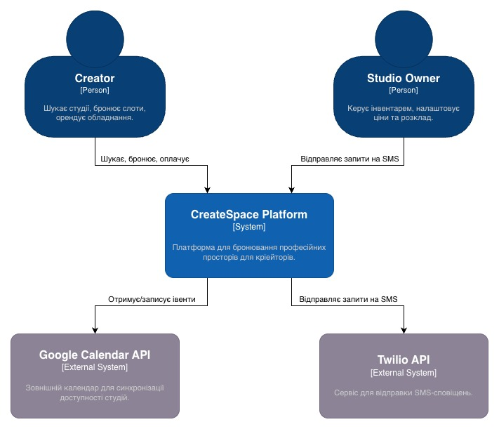

2. **C4 Level 2:** Container

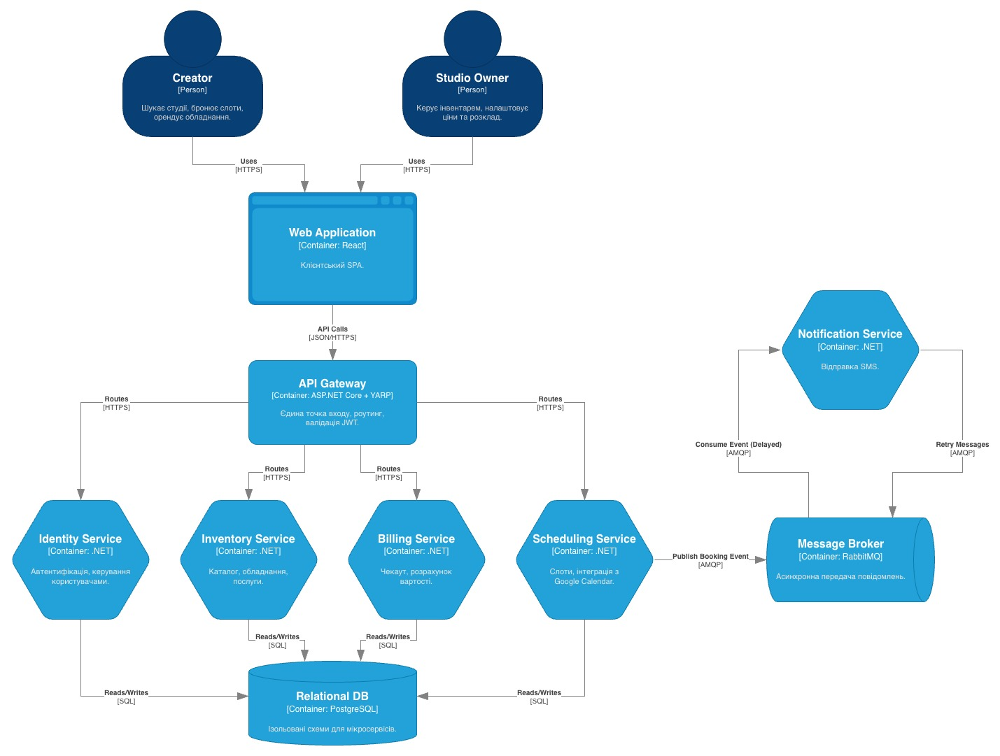

### 3. API Design Guideline

#### 3.1. Протокол та формат даних

* **Протокол:** усі запити виконуються через HTTPS. Архітектурний стиль -- RESTful API.
* **Формат даних:** усі request та response payload передаються у форматі JSON (`Content-Type: application/json`).

#### 3.2. Організація ресурсів та іменування

* **Базовий URL:** `/api/v1`.
* **Іменування ресурсів (URL):** використовуються іменники у множині. Якщо назва складається з декількох слів, використовується `kebab-case` (наприклад, `/api/v1/studio-equipments`).
* **Іменування полів (JSON):** використовується `camelCase` (наприклад, `pricePerHour`, `isAvailable`).

#### 3.3. Версіонування

Версіонування відбувається через URI (наприклад, `v1`, `v2`). Такий підхід забезпечує зворотну сумісність при мажорних змінах контракту.

#### 3.4. HTTP-методи

Використовується стандартний набір HTTP-методів для CRUD операцій:
* **`GET`:** отримання ресурсу або колекції ресурсів;
* **`POST`:** створення нового ресурсу;
* **`PUT`:** повне оновлення існуючого ресурсу;
* **`PATCH`:** часткове оновлення ресурсу (наприклад, зміна статусу);
* **`DELETE`:** видалення ресурсу;
* **Нестандартні дії:** використовується POST із дієсловом у кінці URL (наприклад, `POST /api/v1/bookings/{id}/cancel` для відміни бронювання).

#### 3.5. Формати запитів та відповідей

1. **Структура для `GET`/`POST`/`PUT`/`PATCH`**
    * Для `POST`, `PUT`, `PATCH` дані передаються у тілі запиту (body) як JSON обʼєкт.
    * Для `GET` параметри фільтрації, сортування та пагінації передаються через Query Parameters.
2. **Пагінація**
Використовується offset-based пагінація. Параметри передаються в query: `?page=1&limit=20`. Щоб frontend розумів поточну сторінку та міг рендерити компоненти пагінації, відповідь загортається в обʼєкт з метаданими:
```json
{
  "data": [ /* ...objects collection... */ ],
  "meta": {
    "currentPage": 1,
    "pageSize": 20,
    "totalItems": 150,
    "totalPages": 8,
  }
}
```
3. **Фільтрація та сортування**
    * **Фільтрація:** предається точними ключами в query, наприклад `?spaceType=podcast&minPrice=50`.
    * **Сортування:** параметр `sort`. Префікс `-` означає спадання (DESC). Наприклад, `?sort=-price` (від найдорожчих), `?sort=name` (за алфавітом).
4. **Формат помилок**
Використовується стандарт RFC 7807 (Problem Detauls for HTTP APIs), який нативно підтримується в ASP.NET Core. Приклад:
```json
{
  "type": "https://tools.ietf.org/html/rfc7231#section-6.5.1",
  "title": "One or more validation errors occurred.",
  "status": 400,
  "traceId": "00-1234567890abcdef-12345678-00",
  "errors": {
    "EquipmentId": ["The EquipmentId field is required."],
  },
}
```

#### 3.6. Status Codes
Основні коди:
* **`200 OK`:** Успішний запит (`GET`, `PUT`, `PATCH`, `DELETE`);
* **`201 Created`:** Ресурс успішно створено (`POST`);
* **`204 No Content`:** Запит успішний, але тіло відповіді порожнє (часто для `DELETE`);
* **`400 Bad Request`:** Помилка валідації вхідних даних (payload не пройшов перевірку);
* **`401 Unauthorized`:** Відсутній або невалідний JWT токен;
* **`403 Forbidden`:** Токен валідний, але роль не має доступу до ресурсу;
* **`404 Not Found`:** Ресурс за вказаним ID або URL не знайдено;
* **`409 Conflict`:** Конфлікт бізнес-логіки (наприклад, спроба забронювати вже зайнятий слот);
* **`500 Internal Server Error`:** Непередбачувана помилка на сервері.

### 4. Дизайн API та OpenAPI

Для створення документації використано підхід Docs as Code. Для демонстрації OpenAPI використано середовище Scalar (що по суті являє собою красивий Swagger).

#### 4.1. Inventory Service API

1. **Отримати список обладнання**
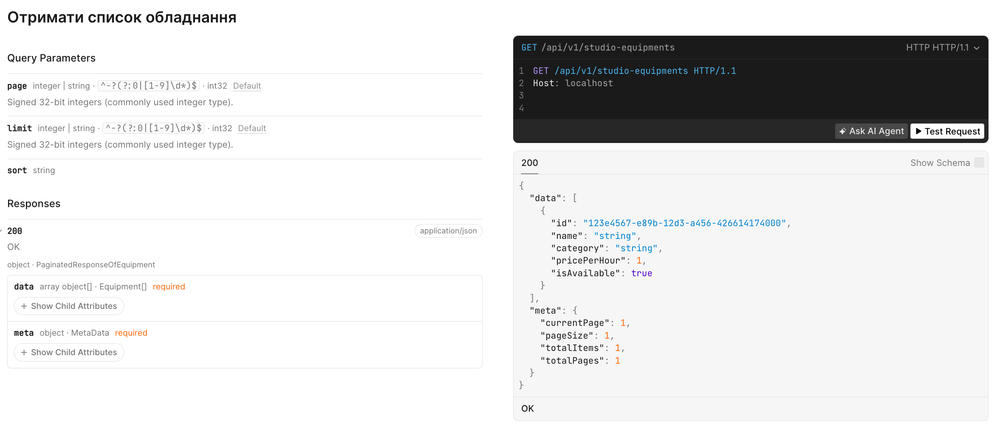
2. **Створити нове обладнання**
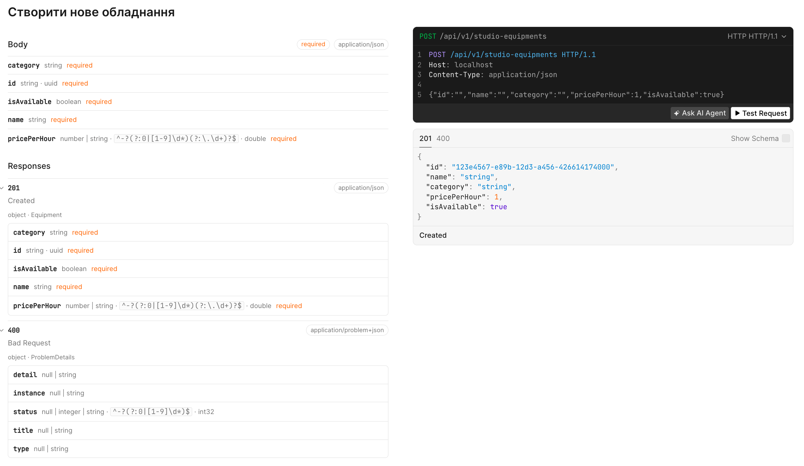
3. **Повністю оновити дані обладнання**
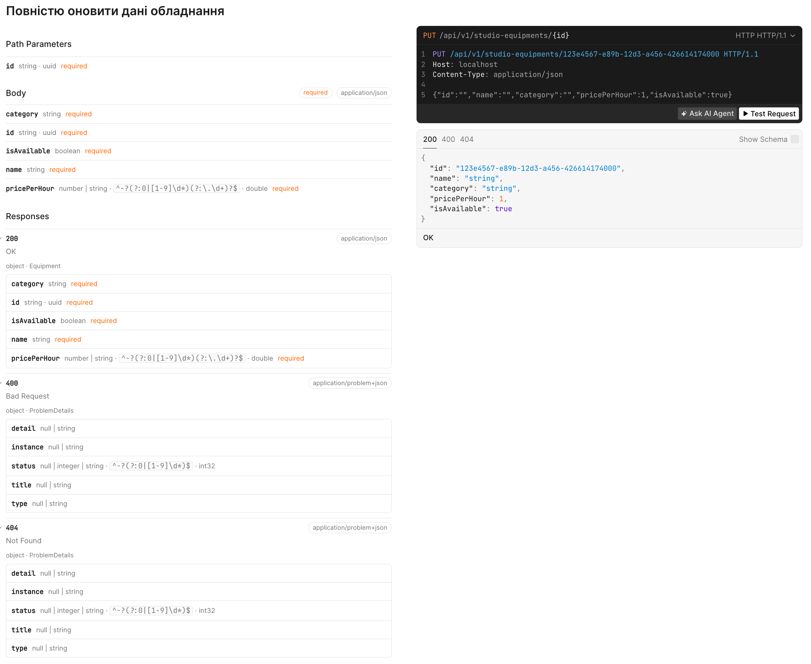
4. **Видалити обладнання з бази**
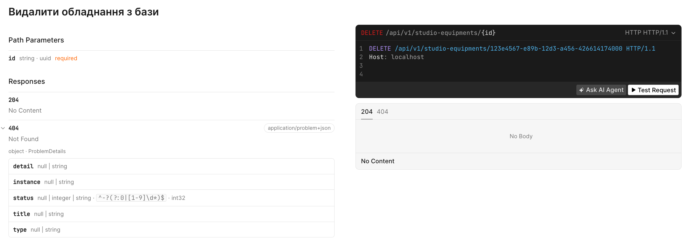
5. **Зробити екіп недоступним**
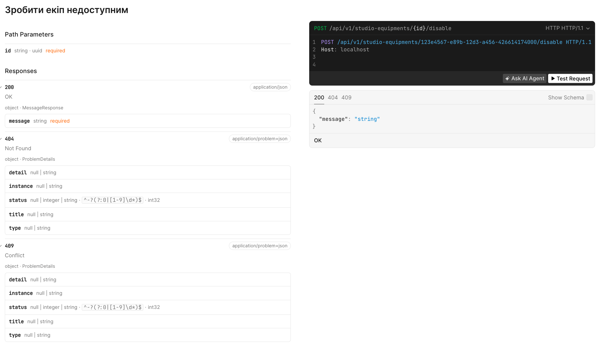

#### 4.2. Scheduling Service API

1. **Отримати список бронювань студії на дату**
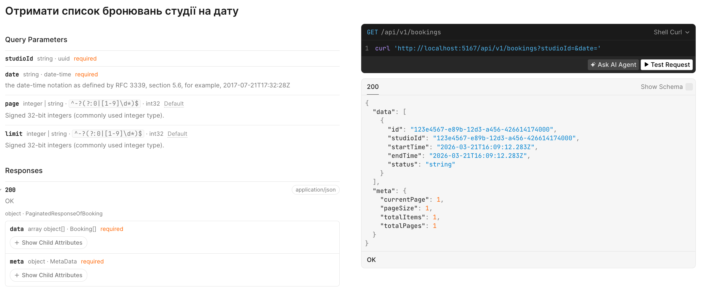
2. **Створити нове бронювання (зайняти слот)**
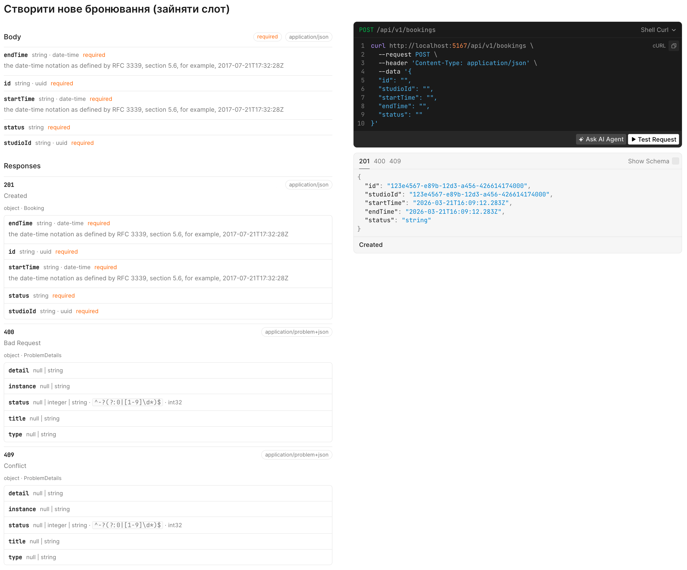
3. **Скасувати бронювання**
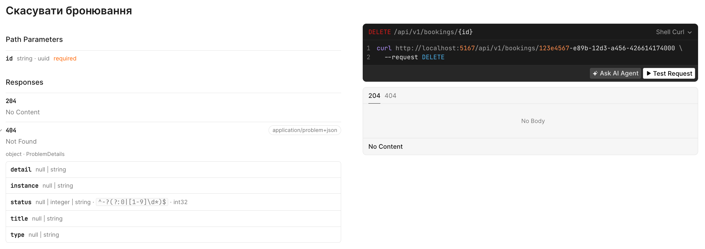
4. **Підтвердити бронювання та засінкати з календарем (custom action)**
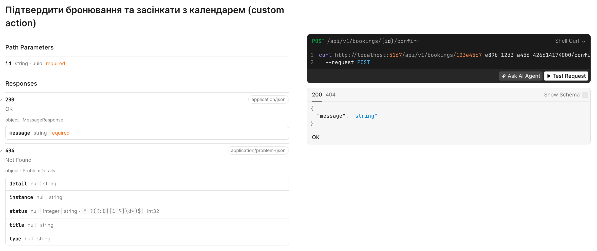

## Source Files
<details>
<summary>
    Exported JSON for Inventory OpenAPI
</summary>

```json
{
  "openapi": "3.1.1",
  "info": {
    "title": "CreateSpace.Inventory | v1",
    "version": "1.0.0"
  },
  "servers": [
    {
      "url": "http://localhost:5153/"
    }
  ],
  "paths": {
    "/api/v1/studio-equipments": {
      "get": {
        "tags": [
          "Inventory"
        ],
        "summary": "Отримати список обладнання",
        "parameters": [
          {
            "name": "page",
            "in": "query",
            "schema": {
              "pattern": "^-?(?:0|[1-9]\\d*)$",
              "type": [
                "integer",
                "string"
              ],
              "format": "int32",
              "default": 1
            }
          },
          {
            "name": "limit",
            "in": "query",
            "schema": {
              "pattern": "^-?(?:0|[1-9]\\d*)$",
              "type": [
                "integer",
                "string"
              ],
              "format": "int32",
              "default": 20
            }
          },
          {
            "name": "sort",
            "in": "query",
            "schema": {
              "type": "string"
            }
          }
        ],
        "responses": {
          "200": {
            "description": "OK",
            "content": {
              "application/json": {
                "schema": {
                  "$ref": "#/components/schemas/PaginatedResponseOfEquipment"
                }
              }
            }
          }
        }
      },
      "post": {
        "tags": [
          "Inventory"
        ],
        "summary": "Створити нове обладнання",
        "requestBody": {
          "content": {
            "application/json": {
              "schema": {
                "$ref": "#/components/schemas/Equipment"
              }
            }
          },
          "required": true
        },
        "responses": {
          "201": {
            "description": "Created",
            "content": {
              "application/json": {
                "schema": {
                  "$ref": "#/components/schemas/Equipment"
                }
              }
            }
          },
          "400": {
            "description": "Bad Request",
            "content": {
              "application/problem+json": {
                "schema": {
                  "$ref": "#/components/schemas/ProblemDetails"
                }
              }
            }
          }
        }
      }
    },
    "/api/v1/studio-equipments/{id}": {
      "put": {
        "tags": [
          "Inventory"
        ],
        "summary": "Повністю оновити дані обладнання",
        "parameters": [
          {
            "name": "id",
            "in": "path",
            "required": true,
            "schema": {
              "type": "string",
              "format": "uuid"
            }
          }
        ],
        "requestBody": {
          "content": {
            "application/json": {
              "schema": {
                "$ref": "#/components/schemas/Equipment"
              }
            }
          },
          "required": true
        },
        "responses": {
          "200": {
            "description": "OK",
            "content": {
              "application/json": {
                "schema": {
                  "$ref": "#/components/schemas/Equipment"
                }
              }
            }
          },
          "400": {
            "description": "Bad Request",
            "content": {
              "application/problem+json": {
                "schema": {
                  "$ref": "#/components/schemas/ProblemDetails"
                }
              }
            }
          },
          "404": {
            "description": "Not Found",
            "content": {
              "application/problem+json": {
                "schema": {
                  "$ref": "#/components/schemas/ProblemDetails"
                }
              }
            }
          }
        }
      },
      "delete": {
        "tags": [
          "Inventory"
        ],
        "summary": "Видалити обладнання з бази",
        "parameters": [
          {
            "name": "id",
            "in": "path",
            "required": true,
            "schema": {
              "type": "string",
              "format": "uuid"
            }
          }
        ],
        "responses": {
          "204": {
            "description": "No Content"
          },
          "404": {
            "description": "Not Found",
            "content": {
              "application/problem+json": {
                "schema": {
                  "$ref": "#/components/schemas/ProblemDetails"
                }
              }
            }
          }
        }
      }
    },
    "/api/v1/studio-equipments/{id}/disable": {
      "post": {
        "tags": [
          "Inventory"
        ],
        "summary": "Зробити екіп недоступним",
        "parameters": [
          {
            "name": "id",
            "in": "path",
            "required": true,
            "schema": {
              "type": "string",
              "format": "uuid"
            }
          }
        ],
        "responses": {
          "200": {
            "description": "OK",
            "content": {
              "application/json": {
                "schema": {
                  "$ref": "#/components/schemas/MessageResponse"
                }
              }
            }
          },
          "404": {
            "description": "Not Found",
            "content": {
              "application/problem+json": {
                "schema": {
                  "$ref": "#/components/schemas/ProblemDetails"
                }
              }
            }
          },
          "409": {
            "description": "Conflict",
            "content": {
              "application/problem+json": {
                "schema": {
                  "$ref": "#/components/schemas/ProblemDetails"
                }
              }
            }
          }
        }
      }
    }
  },
  "components": {
    "schemas": {
      "Equipment": {
        "required": [
          "id",
          "name",
          "category",
          "pricePerHour",
          "isAvailable"
        ],
        "type": "object",
        "properties": {
          "id": {
            "type": "string",
            "format": "uuid"
          },
          "name": {
            "type": "string"
          },
          "category": {
            "type": "string"
          },
          "pricePerHour": {
            "pattern": "^-?(?:0|[1-9]\\d*)(?:\\.\\d+)?$",
            "type": [
              "number",
              "string"
            ],
            "format": "double"
          },
          "isAvailable": {
            "type": "boolean"
          }
        }
      },
      "MessageResponse": {
        "required": [
          "message"
        ],
        "type": "object",
        "properties": {
          "message": {
            "type": "string"
          }
        }
      },
      "MetaData": {
        "required": [
          "currentPage",
          "pageSize",
          "totalItems",
          "totalPages"
        ],
        "type": "object",
        "properties": {
          "currentPage": {
            "pattern": "^-?(?:0|[1-9]\\d*)$",
            "type": [
              "integer",
              "string"
            ],
            "format": "int32"
          },
          "pageSize": {
            "pattern": "^-?(?:0|[1-9]\\d*)$",
            "type": [
              "integer",
              "string"
            ],
            "format": "int32"
          },
          "totalItems": {
            "pattern": "^-?(?:0|[1-9]\\d*)$",
            "type": [
              "integer",
              "string"
            ],
            "format": "int32"
          },
          "totalPages": {
            "pattern": "^-?(?:0|[1-9]\\d*)$",
            "type": [
              "integer",
              "string"
            ],
            "format": "int32"
          }
        }
      },
      "PaginatedResponseOfEquipment": {
        "required": [
          "data",
          "meta"
        ],
        "type": "object",
        "properties": {
          "data": {
            "type": "array",
            "items": {
              "$ref": "#/components/schemas/Equipment"
            }
          },
          "meta": {
            "$ref": "#/components/schemas/MetaData"
          }
        }
      },
      "ProblemDetails": {
        "type": "object",
        "properties": {
          "type": {
            "type": [
              "null",
              "string"
            ]
          },
          "title": {
            "type": [
              "null",
              "string"
            ]
          },
          "status": {
            "pattern": "^-?(?:0|[1-9]\\d*)$",
            "type": [
              "null",
              "integer",
              "string"
            ],
            "format": "int32"
          },
          "detail": {
            "type": [
              "null",
              "string"
            ]
          },
          "instance": {
            "type": [
              "null",
              "string"
            ]
          }
        }
      }
    }
  },
  "tags": [
    {
      "name": "Inventory"
    }
  ]
}
```
</details>

<details>
<summary>
    Exported JSON for Scheduling OpenAPI
</summary>

```json
{
  "openapi": "3.1.1",
  "info": {
    "title": "CreateSpace.Scheduling | v1",
    "version": "1.0.0"
  },
  "servers": [
    {
      "url": "http://localhost:5167/"
    }
  ],
  "paths": {
    "/api/v1/bookings": {
      "get": {
        "tags": [
          "Scheduling"
        ],
        "summary": "Отримати список бронювань студії на дату",
        "parameters": [
          {
            "name": "studioId",
            "in": "query",
            "required": true,
            "schema": {
              "type": "string",
              "format": "uuid"
            }
          },
          {
            "name": "date",
            "in": "query",
            "required": true,
            "schema": {
              "type": "string",
              "format": "date-time"
            }
          },
          {
            "name": "page",
            "in": "query",
            "schema": {
              "pattern": "^-?(?:0|[1-9]\\d*)$",
              "type": [
                "integer",
                "string"
              ],
              "format": "int32",
              "default": 1
            }
          },
          {
            "name": "limit",
            "in": "query",
            "schema": {
              "pattern": "^-?(?:0|[1-9]\\d*)$",
              "type": [
                "integer",
                "string"
              ],
              "format": "int32",
              "default": 20
            }
          }
        ],
        "responses": {
          "200": {
            "description": "OK",
            "content": {
              "application/json": {
                "schema": {
                  "$ref": "#/components/schemas/PaginatedResponseOfBooking"
                }
              }
            }
          }
        }
      },
      "post": {
        "tags": [
          "Scheduling"
        ],
        "summary": "Створити нове бронювання (зайняти слот)",
        "requestBody": {
          "content": {
            "application/json": {
              "schema": {
                "$ref": "#/components/schemas/Booking"
              }
            }
          },
          "required": true
        },
        "responses": {
          "201": {
            "description": "Created",
            "content": {
              "application/json": {
                "schema": {
                  "$ref": "#/components/schemas/Booking"
                }
              }
            }
          },
          "400": {
            "description": "Bad Request",
            "content": {
              "application/problem+json": {
                "schema": {
                  "$ref": "#/components/schemas/ProblemDetails"
                }
              }
            }
          },
          "409": {
            "description": "Conflict",
            "content": {
              "application/problem+json": {
                "schema": {
                  "$ref": "#/components/schemas/ProblemDetails"
                }
              }
            }
          }
        }
      }
    },
    "/api/v1/bookings/{id}": {
      "delete": {
        "tags": [
          "Scheduling"
        ],
        "summary": "Скасувати бронювання",
        "parameters": [
          {
            "name": "id",
            "in": "path",
            "required": true,
            "schema": {
              "type": "string",
              "format": "uuid"
            }
          }
        ],
        "responses": {
          "204": {
            "description": "No Content"
          },
          "404": {
            "description": "Not Found",
            "content": {
              "application/problem+json": {
                "schema": {
                  "$ref": "#/components/schemas/ProblemDetails"
                }
              }
            }
          }
        }
      }
    },
    "/api/v1/bookings/{id}/confirm": {
      "post": {
        "tags": [
          "Scheduling"
        ],
        "summary": "Підтвердити бронювання та засінкати з календарем (custom action)",
        "parameters": [
          {
            "name": "id",
            "in": "path",
            "required": true,
            "schema": {
              "type": "string",
              "format": "uuid"
            }
          }
        ],
        "responses": {
          "200": {
            "description": "OK",
            "content": {
              "application/json": {
                "schema": {
                  "$ref": "#/components/schemas/MessageResponse"
                }
              }
            }
          },
          "404": {
            "description": "Not Found",
            "content": {
              "application/problem+json": {
                "schema": {
                  "$ref": "#/components/schemas/ProblemDetails"
                }
              }
            }
          }
        }
      }
    }
  },
  "components": {
    "schemas": {
      "Booking": {
        "required": [
          "id",
          "studioId",
          "startTime",
          "endTime",
          "status"
        ],
        "type": "object",
        "properties": {
          "id": {
            "type": "string",
            "format": "uuid"
          },
          "studioId": {
            "type": "string",
            "format": "uuid"
          },
          "startTime": {
            "type": "string",
            "format": "date-time"
          },
          "endTime": {
            "type": "string",
            "format": "date-time"
          },
          "status": {
            "type": "string"
          }
        }
      },
      "MessageResponse": {
        "required": [
          "message"
        ],
        "type": "object",
        "properties": {
          "message": {
            "type": "string"
          }
        }
      },
      "MetaData": {
        "required": [
          "currentPage",
          "pageSize",
          "totalItems",
          "totalPages"
        ],
        "type": "object",
        "properties": {
          "currentPage": {
            "pattern": "^-?(?:0|[1-9]\\d*)$",
            "type": [
              "integer",
              "string"
            ],
            "format": "int32"
          },
          "pageSize": {
            "pattern": "^-?(?:0|[1-9]\\d*)$",
            "type": [
              "integer",
              "string"
            ],
            "format": "int32"
          },
          "totalItems": {
            "pattern": "^-?(?:0|[1-9]\\d*)$",
            "type": [
              "integer",
              "string"
            ],
            "format": "int32"
          },
          "totalPages": {
            "pattern": "^-?(?:0|[1-9]\\d*)$",
            "type": [
              "integer",
              "string"
            ],
            "format": "int32"
          }
        }
      },
      "PaginatedResponseOfBooking": {
        "required": [
          "data",
          "meta"
        ],
        "type": "object",
        "properties": {
          "data": {
            "type": "array",
            "items": {
              "$ref": "#/components/schemas/Booking"
            }
          },
          "meta": {
            "$ref": "#/components/schemas/MetaData"
          }
        }
      },
      "ProblemDetails": {
        "type": "object",
        "properties": {
          "type": {
            "type": [
              "null",
              "string"
            ]
          },
          "title": {
            "type": [
              "null",
              "string"
            ]
          },
          "status": {
            "pattern": "^-?(?:0|[1-9]\\d*)$",
            "type": [
              "null",
              "integer",
              "string"
            ],
            "format": "int32"
          },
          "detail": {
            "type": [
              "null",
              "string"
            ]
          },
          "instance": {
            "type": [
              "null",
              "string"
            ]
          }
        }
      }
    }
  },
  "tags": [
    {
      "name": "Scheduling"
    }
  ]
}
```
</details>
